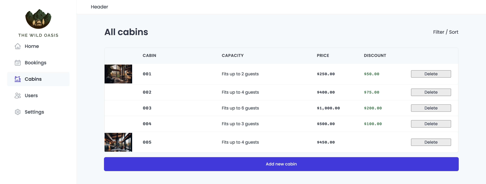

# The Wild Oasis

A Hotel Managment app written in React with TypeScript.

## Tech

### Frontend / UI

- ReactJS
- React Router
- React Hook Form
- Style Components
- UI State - React Context API
- React Query

--- 
### Backend / API

- Supabase - API/Auth/Image Upload

## Resources

- [Date Fns](https://date-fns.org/)
- [React Router](https://reactrouter.com/en/main)
- [Styled Components](https://styled-components.com/)
- [React Icons](http://react-icons.github.io/react-icons/)
- [Supabase](https://supabase.com/)
- [Vite](https://vitejs.dev/)
